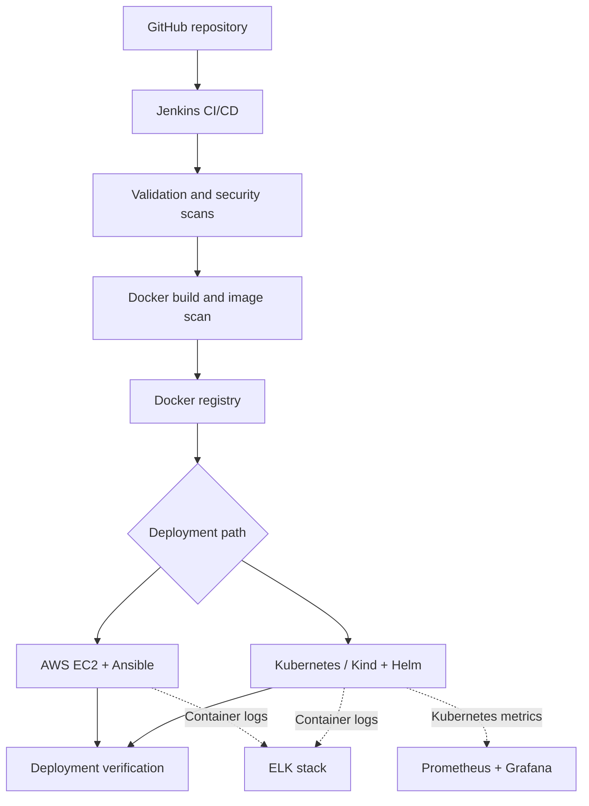

# Nexvion

### DevOps & Cloud-Native Delivery Platform

**An end-to-end DevOps implementation for a company-provided e-commerce application.**

[**Watch Demo**](#project-demo) · [**Architecture**](#architecture) · [**Implementation**](docs/implementation.md) · [**Deployment Guide**](docs/deployment.md)

---

## Overview

Nexvion is a ready-made static e-commerce application provided for a **Davine Technologies DevOps project**. This repository documents the DevOps and cloud-native implementation built around that application—not the original development of the e-commerce frontend.

The project connects source control, containerization, continuous integration and delivery, infrastructure automation, Kubernetes, monitoring, centralized logging, security, and AI-assisted incident analysis.

### At a glance

| Area | Implementation |
| :-- | :-- |
| **Application delivery** | GitHub, Jenkins, Docker, Docker Compose |
| **Cloud infrastructure** | AWS EC2, Terraform, Ansible |
| **Container orchestration** | Kubernetes / Kind, Helm |
| **Observability** | Prometheus, Grafana |
| **Centralized logging** | Elasticsearch, Logstash, Kibana (ELK) |
| **Security** | Trivy scanning, Kubernetes hardening, AWS security controls |
| **AI-assisted operations** | Incident classification, investigation guidance, suggested remediation |

---

## Architecture

> This diagram summarizes the documented delivery components and deployment paths; it does not imply that every component is running simultaneously in a single production environment.

**Explore the architecture:** [Architecture notes](docs/architecture.md) · [Implementation notes](docs/implementation.md)

---

## What I Implemented

<table>
<tr>
<td width="50%" valign="top">

### 01 · CI/CD & Containers

- Containerized Nexvion with **Docker** and **Nginx**.
- Added **Docker Compose** for local deployment.
- Defined a **Jenkins** flow for validation, security checks, image build, registry publishing, deployment, and verification.

</td>
<td width="50%" valign="top">

### 02 · Infrastructure & Deployment

- Used **Terraform** to provision AWS networking and EC2 infrastructure.
- Used **Ansible** for server configuration and container deployment.
- Added **Kubernetes** manifests and **Helm** packaging, including scaling and rolling-update support.

</td>
</tr>
<tr>
<td valign="top">

### 03 · Monitoring & Logging

- Configured **Prometheus** for Kubernetes metrics.
- Used **Grafana** for operational dashboards.
- Used **Logstash, Elasticsearch, and Kibana** for centralized container-log investigation.

</td>
<td valign="top">

### 04 · Security & Incident Analysis

- Added **Trivy** filesystem, secret, and container-image scanning.
- Applied Kubernetes runtime protections and AWS access restrictions.
- Documented **AI-assisted incident analysis** for severity assessment, root-cause investigation, and remediation guidance.

</td>
</tr>
</table>

---

## Project Demo

**Nexvion application walkthrough** — a short recording of the e-commerce homepage and product catalogue.

### [▶ Watch the 35-second Nexvion demo](demo/Nexvion_Project_Demo_GitHub.mp4)

*The recording showcases the application UI. For evidence of CI/CD, infrastructure, monitoring, and security implementation, see the project files and documentation below.*

---

## Repository Guide

| Folder / File | Purpose |
| :-- | :-- |
| [`Jenkinsfile`](Jenkinsfile) | CI/CD pipeline |
| [`Dockerfile`](Dockerfile) and [`compose.yaml`](compose.yaml) | Image build and local deployment |
| [`terraform/`](terraform/) | AWS infrastructure as code |
| [`ansible/`](ansible/) | EC2 configuration and container deployment |
| [`kubernetes/`](kubernetes/) | Kubernetes manifests and runtime resources |
| [`helm/nexvion/`](helm/nexvion/) | Helm packaging |
| [`monitoring/`](monitoring/) | Prometheus and Grafana |
| [`logging/`](logging/) | ELK centralized logging |
| [`security/`](security/) | Security controls and evidence |
| [`ai/`](ai/) | AI-assisted incident analysis |
| [`scripts/`](scripts/) | Bash automation |
| [`docs/`](docs/) | Architecture, implementation, deployment, and troubleshooting |

---

## Documentation

- [Architecture](docs/architecture.md) — component overview and design
- [Implementation](docs/implementation.md) — configuration and build details
- [Deployment](docs/deployment.md) — deployment instructions
- [Troubleshooting](docs/troubleshooting.md) — investigation and common issues

---

**Nexvion · DevOps & Cloud-Native Delivery Platform**

*DevOps implementation built around a company-provided e-commerce application during an internship at Davine Technologies.*

