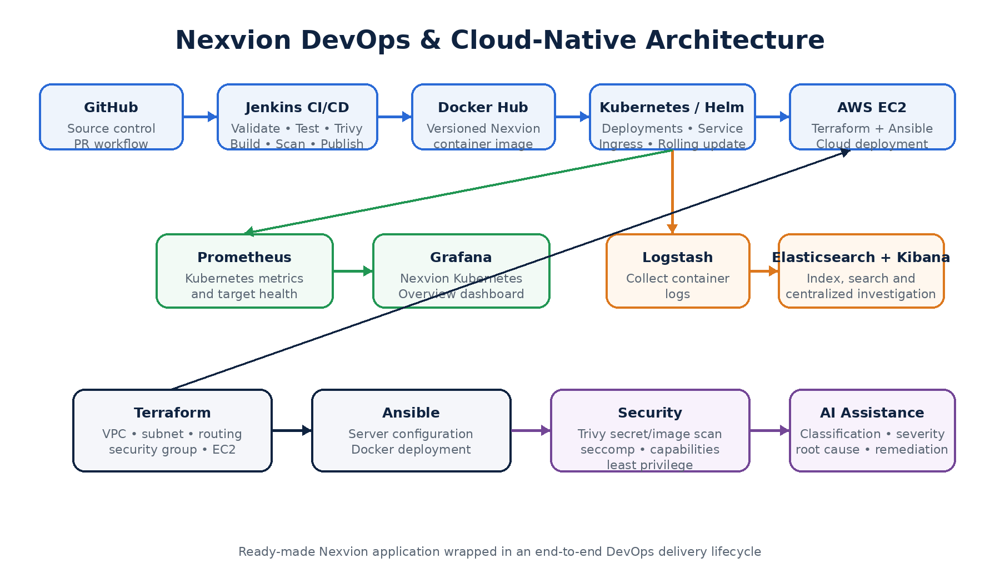
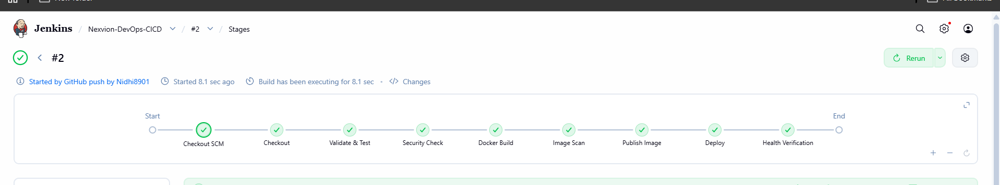
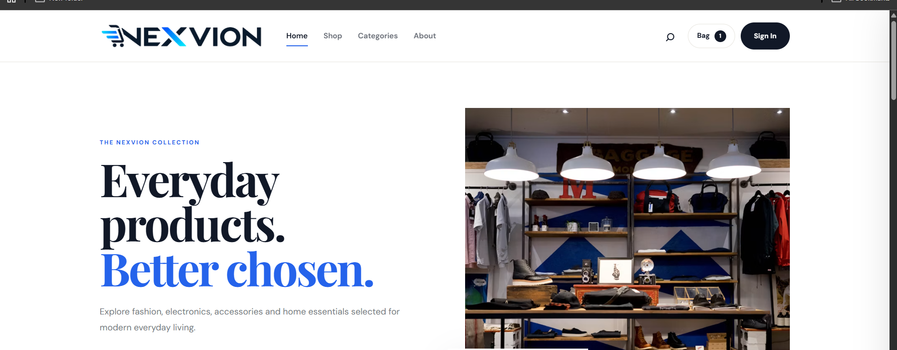
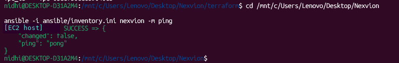
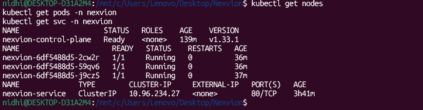
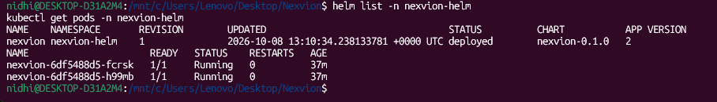
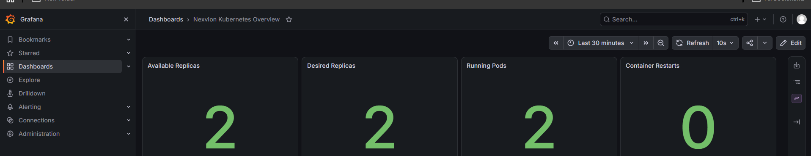
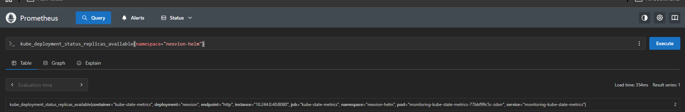
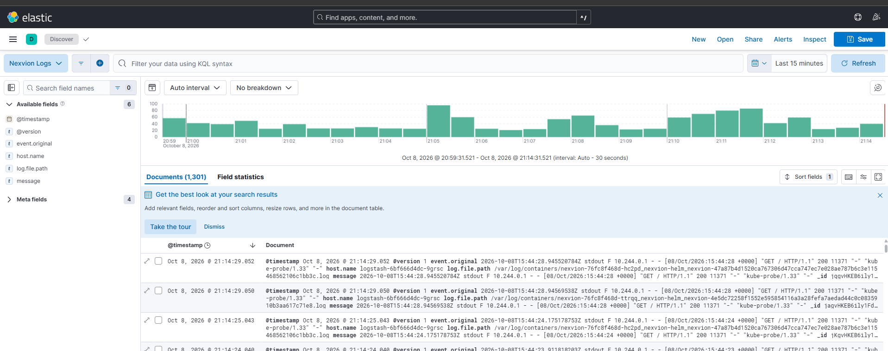
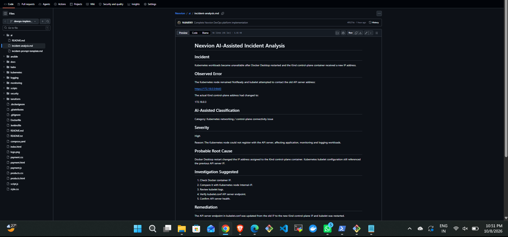

<div align="center">


# NEXVION

### DevOps & Cloud-Native Delivery Platform

**From an existing e-commerce application to an automated, observable deployment workflow.**


[**Architecture**](#architecture) · [**Implementation Evidence**](#implementation-evidence) · [**Project Demo**](#project-demo) · [**Repository Guide**](#repository-guide)

</div>

---

## About the project

**Nexvion** is a ready-made e-commerce website provided as part of a **Davine Technologies internship project**. The work in this repository focuses on the **DevOps, cloud infrastructure, deployment, security and observability implementation** around the existing application, rather than the development of its storefront.

The goal was to connect source control, continuous delivery, containers, Infrastructure as Code, Kubernetes, monitoring and centralized logging into a practical, testable delivery workflow.

| Delivery | Infrastructure | Operations |
| :-- | :-- | :-- |
| GitHub, Jenkins, Docker, Trivy | AWS EC2, Terraform, Ansible, Kubernetes, Helm | Prometheus, Grafana, ELK, AI-assisted incident analysis |

## Architecture

<div align="center">
  
</div>

<sub>Architecture overview from the project evidence report. AWS/Ansible and local Kind/Helm are documented deployment paths, not a claim that every component runs simultaneously in production.</sub>

### Delivery flow

```text
GitHub → Jenkins → Validation & Trivy → Docker build → Image scan
       → Publish image → Deploy → Health verification
```

---

## What I implemented

| Area | Implementation |
| :-- | :-- |
| **CI/CD & containers** | Dockerized the static application with Nginx; added Docker Compose and Jenkins stages for validation, security scanning, image publishing, deployment and health checks |
| **Cloud & automation** | Provisioned AWS resources with Terraform and configured the deployment host using Ansible |
| **Kubernetes** | Created namespace, deployments, services, configuration, scaling/rolling-update resources and a Helm chart for a local Kind cluster |
| **Monitoring** | Queried application/Kubernetes metrics in Prometheus and built a Grafana overview |
| **Centralized logging** | Collected container logs through Logstash, indexed them in Elasticsearch and investigated them through Kibana |
| **Security** | Added Trivy security checks, container-image scanning, Kubernetes runtime hardening and AWS access protections |
| **AI-assisted troubleshooting** | Documented incident classification, root-cause investigation and remediation guidance |

---

## Implementation evidence

These are **screenshots from the actual Nexvion implementation**, selected from the project evidence report. Click any image to view it at full resolution.

### 01 / CI/CD automation

<a href="screenshots/jenkins-pipeline.png"></a>

**Jenkins pipeline:** checkout, validation, security check, Docker build, image scanning, publishing, deployment and health verification completed successfully in the captured run.

### 02 / AWS deployment and server automation

<a href="screenshots/aws-deployed-application.png"></a>

**Application deployed on AWS EC2**, confirmed through a browser session. The browser address bar has been cropped to avoid exposing the public IP in this portfolio image.

<details>
<summary><b>View Ansible connectivity evidence</b></summary>

<br />

<a href="screenshots/ansible-connectivity.png"></a>

Ansible host connectivity returned `SUCCESS` and `ping: pong`.

</details>

### 03 / Kubernetes orchestration and Helm

<table>
<tr>
<td align="center" width="50%">
<a href="screenshots/kubernetes-workloads.png"></a>
<br /><b>Kubernetes workload status</b>
</td>
<td align="center" width="50%">
<a href="screenshots/helm-release.png"></a>
<br /><b>Helm release validation</b>
</td>
</tr>
</table>

A local **Kind** cluster showed a Ready node, healthy Nexvion workloads and service resources. The packaged **Helm** release was deployed in the `nexvion-helm` namespace.

### 04 / Monitoring and observability

<a href="screenshots/grafana-dashboard.png"></a>

**Grafana / Nexvion Kubernetes Overview:** 2 available replicas, 2 desired replicas, 2 running pods and 0 container restarts at the time of capture.

<details>
<summary><b>View Prometheus metrics query</b></summary>

<br />

<a href="screenshots/prometheus-replicas.png"></a>

Prometheus returned **2** for the available-replicas metric in the `nexvion-helm` namespace.

</details>

### 05 / Centralized logging

<a href="screenshots/kibana-logs.png"></a>

**ELK Stack:** Logstash collected Nexvion container logs, Elasticsearch indexed the events and Kibana's Discover view displayed **1,301 documents** in the selected 15-minute window.

### 06 / AI-assisted incident analysis

<details>
<summary><b>View documented incident analysis</b></summary>

<br />

<a href="screenshots/ai-incident-analysis.png"></a>

Documentation of incident severity, potential root causes, investigation guidance and remediation recommendations. This illustrates **AI-assisted analysis**, not autonomous incident repair.

</details>

---

## Challenges and troubleshooting

| Issue encountered | Resolution / learning |
| :-- | :-- |
| Kind node became `NotReady` following a Docker Desktop restart | Corrected the kubelet API-server endpoint after the control-plane IP changed |
| Elasticsearch was slow to become available | Adjusted local resource usage and CPU allocation until the cluster recovered |
| Logstash could see log symlinks but not access the underlying files | Corrected file access using a supplemental group so logs became indexed |
| Kibana access from Windows/WSL was unreliable | Used a temporary local reverse proxy for browser access |

See [`docs/troubleshooting.md`](docs/troubleshooting.md) for further context.

---

## Project demo

**35-second application walkthrough:** Nexvion homepage and product catalogue.

### [▶ Watch the Nexvion application demo](demo/Nexvion_Project_Demo_GitHub.mp4)

> The recording shows the application interface; the screenshots above document the separate DevOps implementation.

---

## Repository guide

| Path | Purpose |
| :-- | :-- |
| [`Jenkinsfile`](Jenkinsfile) | CI/CD workflow |
| [`Dockerfile`](Dockerfile) · [`compose.yaml`](compose.yaml) | Container image and local application deployment |
| [`terraform/`](terraform/) | AWS Infrastructure as Code |
| [`ansible/`](ansible/) | Server configuration and deployment |
| [`kubernetes/`](kubernetes/) | Kubernetes workloads and resource manifests |
| [`helm/nexvion/`](helm/nexvion/) | Helm chart |
| [`monitoring/`](monitoring/) | Prometheus and Grafana configuration |
| [`logging/`](logging/) | Log collection, indexing and visualization |
| [`security/`](security/) | Security configuration and evidence |
| [`ai/`](ai/) | AI-assisted incident analysis |
| [`scripts/`](scripts/) | Bash automation |
| [`docs/`](docs/) | Architecture, implementation, deployment and troubleshooting |

### Documentation

[**Architecture**](docs/architecture.md) · [**Implementation**](docs/implementation.md) · [**Deployment**](docs/deployment.md) · [**Troubleshooting**](docs/troubleshooting.md)

---

<div align="center">

**Nexvion • DevOps & Cloud-Native Delivery Platform**

<sub>DevOps implementation completed around a company-provided application as part of a Davine Technologies internship.</sub>

</div>
